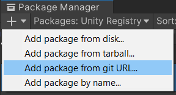
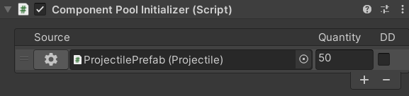
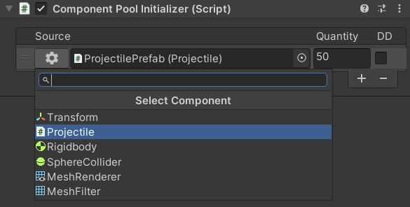
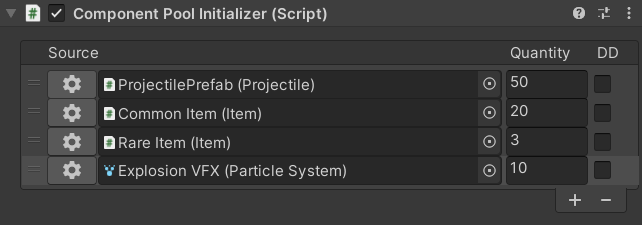

# Unity Component Pool #

## Description

Pooling system designed to work with Unity components. Using the component pool essentially comes down to replacing `Object.Instantiate` calls with `ComponentPool.Get`. Component instances (created with `ComponentPool.Get`) are pooled by simply disabling their game objects, allowing them to be reused (or unpooled) on subsequent `ComponentPool.Get` calls. 

### Example

```cs
[SerializeField]
MyComponent sourceComponent;

MyComponent _instance;

void Awake()
{
   // Retrieve pooled instance. A new instance will be created if the source component's pool is empty.
   _instance = ComponentPool.Get(sourceComponent);
}

void Start()
{
   _instance.DoSomething();

   // Instances created with ComponentPool by disabling their game objects.
   _instance.gameObject.SetActive(false);
}
```

## Installation

Can be installed with the [Package Manager](https://docs.unity3d.com/Manual/upm-ui-giturl.html) or by copying the repository's contents in your project.



```
https://github.com/jeffbert/Unity-Component-Pool.git
```

## Initializing instances

Component instances can be initialized with the `ComponentPoolInitializer` component. It's important to specify the component type that you want to pool, since pools are created per source component (and not per game object).



You can change the component that will be pooled by clicking the gear button.



Different types of components can be initialized within the same `ComponentPoolInitializer` component.



## API

### `ComponentPool.Get`

Get an instance of the source. A new instance will be created if the pool is empty.
```cs
[SerializeField]
MyComponent source;

void Awake()
{
   MyComponent instance = ComponentPool.Get(source, transform.position, transform.rotation);
}
```

### `ComponentPool.GetMany`

Gets many instances in a single call.

**List:** Adds the specified amount of instances to the list.

```cs
[SerializeField]
MyComponent source;

private List<MyComponent> _instances = new List<MyComponent>();

void Awake()
{
   ComponentPool.GetMany(_instances, source, 10, transform.position, transform.rotation);
}
```

**Array:** Replaces all elements of the array with instances.
```cs
[SerializeField]
MyComponent source;

private MyComponent[] _instances = new MyComponent[10];

void Awake()
{
   ComponentPool.GetMany(_instances, source, transform.position, transform.rotation);
}
```

### `ComponentPool.DestroySourceInstances`

Destroys all component instances of the specified source and clears the source's pool.

```cs
[SerializeField]
MyComponent source;

[SerializeField]
MyComponent otherSource;

void Awake()
{
   MyComponent instance = ComponentPool.Get(source);
   MyComponent otherInstance = ComponentPool.Get(otherSource);

   ComponentPool.DestroySourceInstances<MyComponent>(source);

   Debug.Log(instance == null);        // True
   Debug.Log(otherInstance == null);   // False
}
```

### `ComponentPool.DestroyInstances<T>`

Destroys all component instances of the specified `T` type and clears all `T` pools.

```cs
[SerializeField]
MyComponent source;

[SerializeField]
MyComponent otherSource;

void Awake()
{
   MyComponent instance = ComponentPool.Get(source);
   MyComponent otherInstance = ComponentPool.Get(otherSource);

   ComponentPool.DestroyInstances<MyComponent>();

   Debug.Log(instance == null);        // True
   Debug.Log(otherInstance == null);   // True
}
```

## Misc ##

- [CHANGELOG](CHANGELOG.md)
- [LICENSE](LICENSE)
